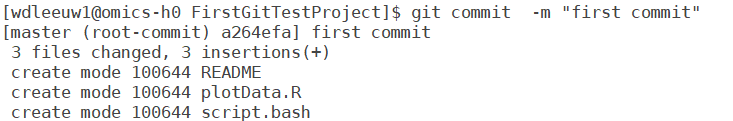

# Getting started
Git is a distributed version tracking system with broad functionality and many options. A basic hands on introduction using Crunchomics somewhat targeted to bioinformatics projects is given here. In the first part of the practical which explains the basic usage of git is  more or less cut and paste. The practical, however, should also be considered a invitation to experiment and for example, if you think you might start using git, to set up a personal  environment which you like for example by setting up a github account and/or installing git on your local computer.  

 
To start the practical log in to Crunchomics. Git is installed on the system however it has to be configured for a user once using the following commands: 

```
git config --global user.name  "put your name here"
git config --global user.email "put your email here"
git config --global core.editor nano 
```
This has to be done only once on each system you use git. The information is stored in the file **.gitconfig** in your home directory.  Other configuration information can be stored there as well.

Note, the version of git on Crunchomics (1.8.3.1) is the version which comes with CentOS 7.  There are newer versions of git with more options, keep that in mind while looking for information about git usage on the internet. 

# Initializing a project

Now We will create a example project 
```
PROJ_DIR="/zfs/omics/personal/$USER/FirstGitTestProject"
mkdir -p $PROJ_DIR
cd $PROJ_DIR
```
The directory used here will work but is somewhat arbitrary, ou are free to use a different locationfor your test project by changeing `PROJ_DIR` above.  Now we will initialize git for the project 
```
git init
 
```

Git now initialized the repository. The current status of a project is accessible using 
```
git status 
```
We now have an empty repository.  Note the directory does not need to be empty. Any project can be turned into a git project be running git init and adding the existing files.  Now do some work i.e. create some files.
```
echo "Information about the project" >  README 
echo "plot(0,0)" >  plotData.R
echo '#!/bin/bash' >  script.bash 
echo "temporary data" > temporary_data.txt
```

# Staging and committing 

Files have to be explicitly added into the repository. In this example,  of the four files created we want to add only three to the repository.  We do not want to keep track of the temporary data file. The first step is staging: 
```
git add README plotData.R script.bash
```

Using **git add**  the files are **staged**. It means they will be stored in the repository in the current form at the next **commit**. However they are not yet committed into the repository.  If additional changes are made to files before a commit, the files have to be staged again if the changes have to be included into the commit.  Using commit the currently staged version of all staged files is stored.    
To the following command is used to commit  the staged files. 
```
git commit -m "First commit of project " 
``` 
Using the `-m` parameter a commit message is given these messages can inspected 
{width=480}

Using the `-m` parameter a commit message is given these messages can used to identify commits later on. The files are stored in the repository with a **commit hash** ( `a264efa` in the example above). These codes uniquely identify a commit and can be used to refer to a specific commit later on.  So if a file is committed that version of the file can is can be restored at any later point.  

# Restoring

With the project committed we can safely edit the project without fear of messing things up. 
The commit protects the project against accidents.  If for example we overwrite or delete a file or we decide that the changes made to a file do not work as intended the last version of the file can be checked out from the repository.
```
rm README #  file is gone.
git checkout README
ls README  # restored to last committed version
```

# Committing new versions and tagging 

```
echo "Lorum ipsum factum" >>   README  # add some text to README
git add README
git commit -m "Updated information in README"
git log
``` 

One way to use tags is to use instead of the `commit hash`. A tag is attached to the last commit using git tag 
```
    git tag "version_0.1"
```
This tag can be used to identify committed versions 


# Branching  and merging 
A branch is an independent track of a project. All changes to the branch are local to that branch and do not influence other branches.  
Branching can be used to: 
  - work on new developments which might or might not lead to some stable result to be included in the master branch at some later point
  - work on the project from different locations 
  - work on a project with multiple people. Each person works on an own version which might be merged in into the master branch or some other branch. 
  
{width=480}

To start a new branch 
```
   git checkout -b mightwork
```

Now we are in a separate branch with the name **mightwork**  All changes made to the project, changes to files, new files added are only in that branch.  The **master** the name of the default branch or trunk of the project, will remain unchanged. Additions and commits will be in the branch created. 
```
    echo " Trying some algorithm which might not work" >> README  # add text to readme
    touch  development.R    #  Create a new file
    git add README development.R
    git commit -m "First commit in mightwork"
``` 
The is now committed. All the project files in the directory are equal to the committed. The working directory is clean. In this state we can switch between branches. For example if we want to continue working on the master  we can checkout the master.   
```
    git checkout master 
```
If you check the directory you will notice it will not contain the file development.R.  As  this file not part of the master branch. Switching between branches it not all changes are committed will work only if no work will be lost. 
Try: 
```
   git checkout mightwork 
   echo "some development stuff " >> development.R  # do some work
   git checkout master
```
You will get an error because git is protecting your work, switching to the master would imply removing the file development.R with the uncommitted changes made to it. 
   
# Merging 
If the work of to branches has to be combined into a single branch, it is called merging. For example if the work in the mightwork branch actually works we want to include it in the master. While  in the master branch run the command: 
```
   git merge mightwork
```

# Cloning 

Cloning a repository means a copy of the whole repository including the history and branches is made. To experiment with  cloning  you can install git on your local computer (check https://git-scm.com/) and clone the repository you just created to you local computer. If you you prefer you can clone the repository to a different directory on Crunchomics.  The windows and mac versions of git offer both a gui and a bash shell to interact with a repository. In the shell you run the command
```
  git clone <UvAnetID>@omics-h0.science.uva.nl:<path_to_repository_on_omics>
```
If you are cloning to a different location on the same computer use 

```
   git clone <path_to_repository>  [new_name]
```
The `new_name` parameter is only needed if the original and clone have the same parent directory. As the default name is the name of the directory the repository was initialized in.   


# Parallel development 

With more than one copy of a repository the content can diverge as each copy is basically independent. Usually the in the clones independent development takes place by one or more persons. Best practice is to start a new branch  in each clone in which development takes place using:
```
   git checkout -b [branchname]
```
After one or more local commits to the branch the origin repository can be updated using the command 
```
   git push 
```
This will incorporate the changes in the original repository. If no branch was created pushing will in general not be possible. The reason is that on the original (upstream) repository the master is probably also checked out. It would no longer be possible to commit files as the head would already have moved on by the push of the clone since the last commit. 

After a branch has been pushed from a clone in the original repository the branch can be merged into the master using the merge command
```
   git merge [branchname] 
```
Now git will try to merge the changes to the repository in the branch with the master. If conflicts arise, i.e. automatic merging  is impossible the files in which conflicts arise will contain text like 
```
<<<<<<< HEAD
Some content added in head
=======
totally different content 
>>>>>>> branchname
```
After editing out these conflicts, adding and committing a merged version can be made. 

Another way to keep repositories in sync during development is fetching and merging. Usually in the clone (downstream)  the changes on the master branch since the start of the branch can be incorporated in the current branch using. 

```
git fetch master
git merge
```

# Github 

Up to now we we used a local git repository. It is hosted in a directory on Crunchomics. Access is possible only for people with have access to that particular directory on Crunchomics.  Github is a website owned by Microsoft which hosts git repositories. Repositories which are either personal or  public are hosted free of charce.  Non public multi user repositories are available on a subscription basis. 

After creating an account on [github](https://github.com) you can store your repositories accessible from any location and make it available world wide. Many bioinformatics projects make code available in this way. Using the git commands you can access the repositories. Without an gitub account  you can download the repositories using 
```
  git clone git://github.com/SomeUser/SomeRepo.git
```
If you have an account and set up [access keys](https://docs.github.com/en/authentication/connecting-to-github-with-ssh/adding-a-new-ssh-key-to-your-github-account) you can clone a repository using.
```
  git clone git@github.com:UserName/OtherRepo.git
```
Using this way of cloning you can not only commit local changes but also push commits back to the github repository.   

The properties of universal accessibility and version management are used by researchers as an easy way to make R packages available. While the requirements for inclusion in CRAN or Bioconductor are not trivial anybody can put the package code available on github. The devtools package offers the  `install_github()` function which  be used to install R packages straight from github. 


